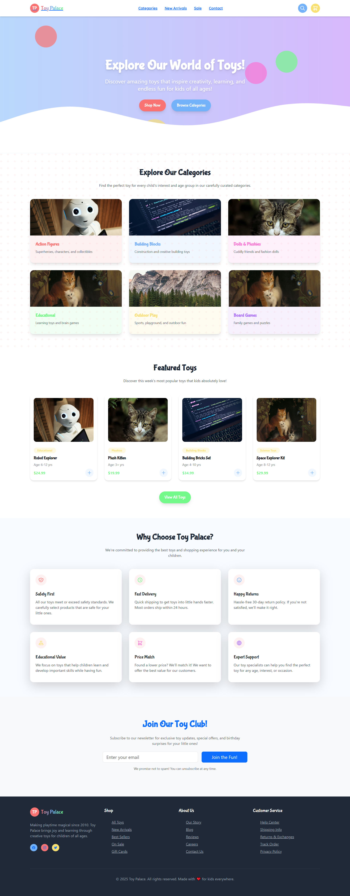

# 🎠 Toy Palace

**Welcome to Toy Palace!**  
An interactive and delightful toy store website where parents and gift-givers can explore a vibrant world of toys. From classic wooden puzzles to modern tech toys, our palace has something magical for every child.

---

## ✨ Features

- 🎁 **New Arrivals** – Explore the latest, trendiest toys.
- 🧸 **Browse by Category** – Dolls, Puzzles, STEM Kits, Outdoor, and more.
- 🛍️ **Sales Section** – Get your hands on discounted favorites.
- 🌈 **Vibrant, Kid-Friendly Design** – A UI crafted with joy and accessibility in mind.
- 📱 **Fully Responsive** – Smooth experience across all devices.

---

## 📸 Screenshots

### 🧸 Home Page

### 🧸 Categories View
![categoriesScreen]vite-project/photo2.png)

### 🧸 Product Details

### 🧸 Sale Page

---

## 🛠️ Built With

- **HTML5 & CSS3**
- **Tailwind CSS**
- **Vite**
- **React + Hooks**
- **React Router**

---

## 💡 UX Highlights

- Intuitive and colorful layout designed for family users
- Friendly fonts and cheerful colors
- Simplified navigation for quick browsing
- Accessible animations and microinteractions

---

